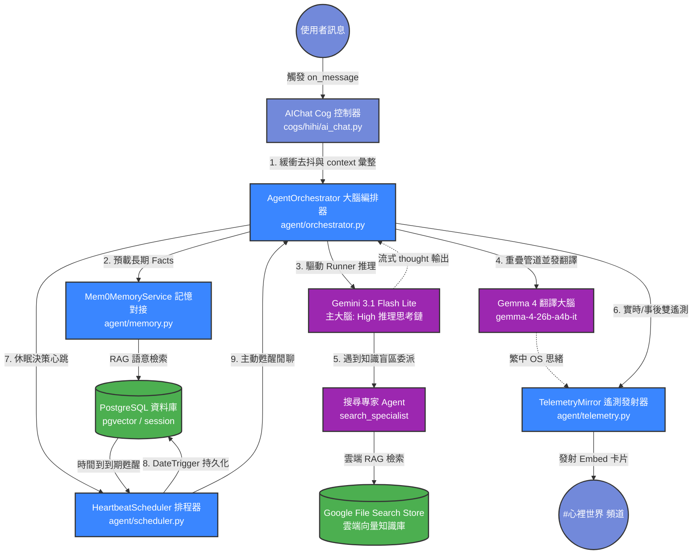

# 🧠 HiHi AI Agent 大一統模組化套件 (Architecture Guide)

本套件 (`discord_bot/agent/`) 是 Discord 數位生命體「嗨嗨 (HiHi)」的 AI 大腦與決策核心。為了落實控制層與推理層的解耦，本專案將所有 AI 相關的邏輯（大腦編排、定時排程、記憶對接、遙測播報、驗證模型與委派工具）全面收攏至此套件中。

---

## 🏗️ 系統架構圖 (Architecture Overview)

以下是「嗨嗨」訊息推理流與自主生理休眠排程的運作架構圖：

---

## 📂 模組目錄說明 (Module Catalog)

本套件採用高度解耦的結構，各模組職責分工如下：

| 檔案名稱 | 角色定位 | 核心職責 |
| :--- | :--- | :--- |
| [**`__init__.py`**](file:///home/hi6688/servers/discord_bot/agent/__init__.py) | 套件進入點 | 導出核心 API 與類別，對外隱藏包內部結構。 |
| [**`orchestrator.py`**](file:///home/hi6688/servers/discord_bot/agent/orchestrator.py) | 大腦編排器 | 1. 實例化 Google ADK `Runner`、主 Agent 與子 Agent。 2. 處理 ReAct 推理循環，捕獲 Thought 思考鏈。 3. 實作 GDPR Facts 物理銷毀與長期事實對接。 |
| [**`scheduler.py`**](file:///home/hi6688/servers/discord_bot/agent/scheduler.py) | 定時心跳排程器 | 1. 託管 APScheduler 4.0 異步排程週期。 2. 利用 `finally` 區塊強制 dispose 資料庫連線池以防連線洩漏。 3. 處理 Misfire 到期補償甦醒閒聊。 |
| [**`tools.py`**](file:///home/hi6688/servers/discord_bot/agent/tools.py) | 智能代理工具箱 | 1. 定義 `HiHiAgentTool` (重寫 ADK 委派，攔截子代理獲取 RAG 結果並發射 Live 遙測)。 2. `get_agent_tools` 提供大腦事實與排程的註冊接口。 |
| [**`schemas.py`**](file:///home/hi6688/servers/discord_bot/agent/schemas.py) | 驗證模型庫 | 存放 Pydantic 強型別防禦模型（如 `SleepScheduleParams` 等）。 |
| [**`memory.py`**](file:///home/hi6688/servers/discord_bot/agent/memory.py) | 記憶原生服務 | 繼承 ADK `BaseMemoryService`，直連 Mem0 v3 引擎，進行增量提煉事實與 `pgvector` 同步落盤。 |
| [**`telemetry.py`**](file:///home/hi6688/servers/discord_bot/agent/telemetry.py) | 遙測播報鏡像 | 負責向 `#心裡世界` 頻道發射 Live 黃色工具播報，以及生成 Post-Mortem 綜合藍色報告大 Embed 卡片。 |
| [**`config.py`**](file:///home/hi6688/servers/discord_bot/agent/config.py) | 會話連線配置 | 宣告 ADK 官方 `DatabaseSessionService` 連線，自動轉換協議以相容 `asyncpg`。 |

---

## 🛠️ 關鍵工程亮點 (Key Engineering Highlights)

### 1. 🧠 管道並行重疊思緒翻譯技術 (Pipeline Overlapping)
在 `call_adk_runner` 推理循環中，主大腦以進階思考模式（Thinking Config）生成英文 OS 思緒。為了解決翻譯帶來的延遲：
* 當主大腦一開始吐出發言文本（代表思緒 Chunk 已累積完畢），編排器會立刻以 `asyncio.create_task` 在背景**非同步啟動 Gemma 4 進行翻譯**。
* 翻譯與主大腦後續的發言生成、工具回調完全在時間線上**重疊並發**。
* 當最終對話結束時，繁中 OS 思緒已在背景翻譯完成，實現遙測 Embed 卡片 **0 延遲** 立即發射！

### 2. 🔌 PostgreSQL 連線池洩漏防禦 (Connection Pool Dispose)
為防範生產環境下 Scheduler 持久化任務頻繁讀寫引發 Postgres 連線洩漏：
* `scheduler.py` 實作了異步排程的託管。
* 當背景排程任務遭中斷、取消或拋出異常退出時，`finally` 區塊保證 100% 執行 `await engine.dispose()`，物理釋放 SQLAlchemy 連線池。

### 3. 🎯 記憶隔離防污染設計 (Scoped Memory Isolation)
對齊 Mem0 官方最佳實踐：
* **主大腦**掛載 `manage_fact_tool` 以讀寫用戶的長期 Facts 記憶。
* **搜尋專家 (search_specialist)** 作為無狀態 (Stateless) 的子代理，物理上不掛載任何記憶寫入回調，徹底避免了子代理在聯網搜尋或讀取網頁 RAG 時，將網頁雜訊寫入用戶個人事實庫中。
